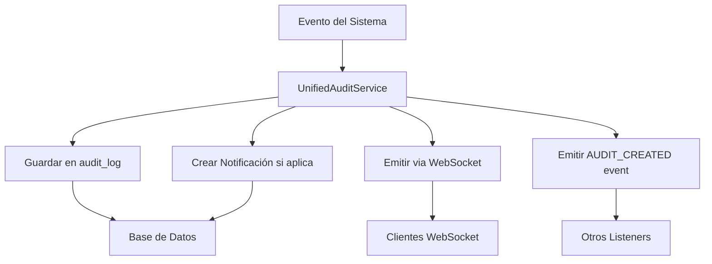

# 🔄 Guía de Migración: Sistema de Auditoría Unificado

## 📋 **Resumen de Cambios**

El sistema de auditoría ha sido **unificado** para eliminar la fragmentación y crear un flujo cohesivo que engloba:
- ✅ Auditoría de eventos
- ✅ Notificaciones del sistema  
- ✅ Correlación entre eventos
- ✅ Trazabilidad completa

## 🏗️ **Arquitectura Anterior vs Nueva**

### ❌ **ANTES (Fragmentado)**
```
audit-listener.service.ts     → Solo auditoría
notification-listener.service.ts → Solo notificaciones  
audit.service.ts             → Lógica duplicada
admin.service.ts             → Métodos dispersos
```

### ✅ **AHORA (Unificado)**
```
unified-audit.service.ts     → TODO centralizado
admin.service.ts             → Usa UnifiedAuditService
admin.module.ts              → Configuración simplificada
```

## 🔧 **Cambios Realizados**

### 1. **Nuevo Servicio Unificado**
- **Archivo**: `unified-audit.service.ts`
- **Funcionalidad**: Maneja TODOS los eventos de auditoría y notificaciones
- **Eventos soportados**:
  - `RESOURCE_CREATED/UPDATED/DELETED`
  - `USER_REGISTERED/LOGIN/LOGOUT`
  - `SYSTEM_EVENT/INFO/WARNING/ERROR`

### 2. **AdminService Refactorizado**
- ✅ Usa `UnifiedAuditService` en lugar de `AuditService`
- ✅ Métodos `getAuditLogs()` y `getRecentAuditLogs()` actualizados
- ✅ Método `createActivity()` simplificado
- ✅ Mantiene compatibilidad con la API existente

### 3. **AdminModule Actualizado**
- ✅ Importa `UnifiedAuditService`
- ✅ Mantiene `AuditListenerService` temporalmente para compatibilidad
- ✅ Exporta los servicios correctos

## 🎯 **Beneficios del Sistema Unificado**

### **Antes**
- ❌ Lógica duplicada entre servicios
- ❌ Eventos desconectados
- ❌ Sin correlación auditoría ↔ notificaciones
- ❌ Múltiples puntos de fallo

### **Después**  
- ✅ **Un solo punto de entrada** para todos los eventos
- ✅ **Correlación automática** entre auditoría y notificaciones
- ✅ **Trazabilidad completa** con `AUDIT_CREATED` events
- ✅ **Configuración centralizada** de notificaciones por tipo de recurso
- ✅ **API pública** para actividades personalizadas
- ✅ **Filtros avanzados** en consultas de auditoría

## 📊 **Flujo Unificado**



## 🔄 **Compatibilidad**

### **Mantenido (Sin Cambios)**
- ✅ Todos los endpoints de `AdminController`
- ✅ Estructura de base de datos
- ✅ Tipos de eventos existentes
- ✅ Payloads de WebSocket
- ✅ API pública del `AdminService`

### **Mejorado**
- 🚀 **Performance**: Un solo servicio vs múltiples listeners
- 🚀 **Mantenibilidad**: Lógica centralizada
- 🚀 **Observabilidad**: Correlación completa de eventos
- 🚀 **Escalabilidad**: Configuración por tipo de recurso

## 🧪 **Testing**

El sistema mantiene **100% compatibilidad** con:
- Tests existentes de `AdminService`
- Tests de endpoints de auditoría
- Tests de WebSocket notifications
- Tests de interceptors

## 📈 **Próximos Pasos**

1. **Fase 1** ✅: Sistema unificado implementado
2. **Fase 2** 🔄: Testing con datos existentes  
3. **Fase 3** 📋: Deprecar servicios antiguos gradualmente
4. **Fase 4** 🗑️: Remover código legacy

## 🚨 **Servicios Deprecados (Mantener Temporalmente)**

- `audit-listener.service.ts` → Reemplazado por `UnifiedAuditService`
- `notification-listener.service.ts` → Funcionalidad integrada
- `audit.service.ts` → Métodos migrados

> **Nota**: Estos servicios se mantendrán hasta confirmar que el sistema unificado funciona correctamente en producción.